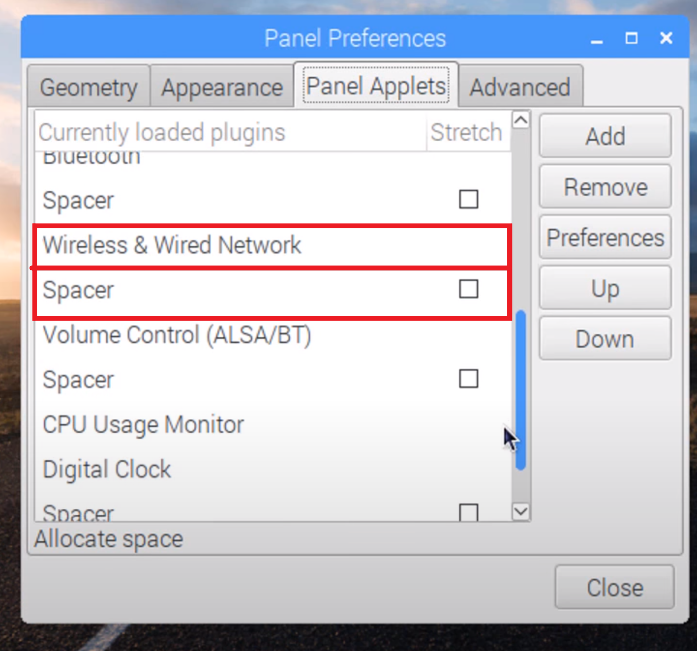
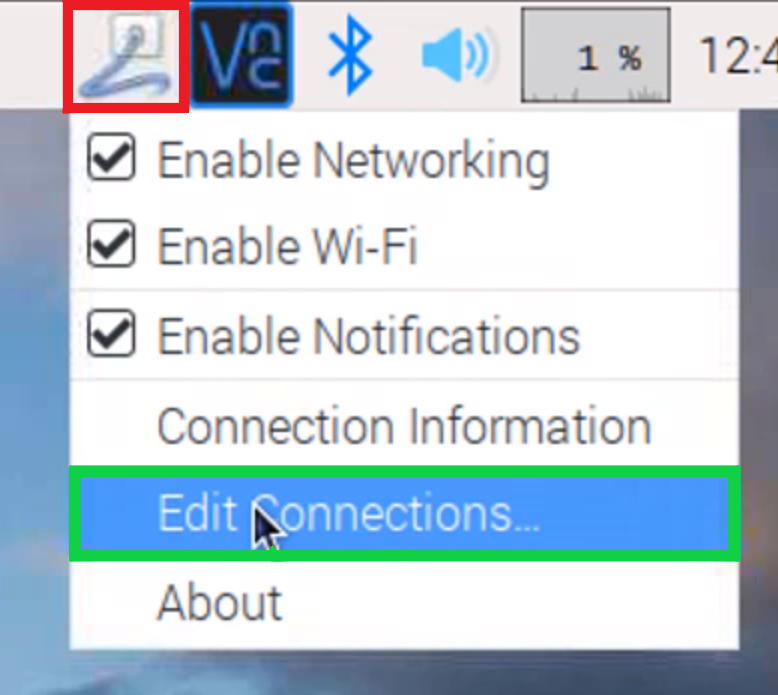

# RPi-VR-App-Development
This repository is a mini hobby project by **Akella Niranjan** & **Katta Ganesh**. 
The current project "RPi VR" is a Raspberry Pi (Model 3B) based VR video streaming mechanism which can be used in a wide range of surveillance & UAV (Unmanned Aerial Vehicle) applications.

 

### Components
#### Hardware:
-  Raspberry Pi 3B
-  Picamera - 5MP
-  Class 10 32GB SD Card
-  VR Headset
-  Android Smartphone

#### Software:
- Raspbian OS
  

## Setup
Initially clone the repository on your desktop.

~~~ 
cd Desktop/ 
~~~
~~~ 
git clone https://github.com/niranjanstudy06/RPi-VR-App-Development.git 
~~~ 
 

## Hotspot Setup

Execute the **RPi_VR_Script.sh** script file.
~~~ 
chmod +x RPi_VR_Script.sh

./RPi_VR_Script.sh
~~~ 
After running the script, remove the Wireless, Wired Networks and the Spacer settings from the **Panel Applets** :
- Right-click on the "Task Bar"
- Click on "Panel Settings"
- Browse to "Panel Applets"
- In the appeared menu, scroll down and **Remove** the "Wireless & Wired Network" and "Spacer" settings by selecting them individually.

    
 

- After removing the above-mentioned applets, close the panel and reboot the system to apply changes.
  ~~~ 
  sudo reboot
  ~~~

- After the system boot's up, You will be alble to notice a wired icon on the taskbar.
- Right-click on it and navigate to **Edit Connections** as shown in the below image.

    

- On the appeared "Network Connections" panel click on add, to add new entities.
- Choose the connection type as WiFi from the drop-down menu and click on create. Wait for couple of seconds, then another dialogue box will appear with "Editing WiFi Connection". Enter your desired connection name on the top of the panel.
- In the **SSID** section choose your desired name for your Hotspot network.
- Select **Mode** as "Hotspot".
- Go to the Wi-Fi Security panel in the dialogue box and select the security type as **WPA & WPA2 Personal** and enter the desired passphrase for your hotspot network.
- Save changes and Reboot the system.
    ~~~ 
    sudo reboot 
    ~~~

- Now you should be able to connect to the newly created hotspot from an external device.

  

## Setup Static Hotspot IP address

To setup a static IP address on the raspberry pi hotspot, initially navigate to the dhcpcd configuration file.:

~~~
sudo nano /etc/dhcpcd.conf
~~~
- Add the following info at the end of the config file:
    ~~~
    interface wlan0
    static ip_address=10.42.0.1
    static routers=10.0.0.1
    static domain_name_servers=75.75.75.75 75.75.76.76 2001:558:feed::1 2001:558:feed::2
    ~~~
- Reboot the system.
    ~~~
    sudo reboot
    ~~~
  

## Picamera Streaming

After setting up the hotspot on the raspberry, connect the Picamera module and run the python script.

~~~
python3 RPi_VR.py
~~~
The above script setups a web streaming mechanism in an infinite loop. To access this stream browse to "http://10.42.0.1:8000".   

## Stream to VR App

- Install the RPi_VR.apk file on an android device. Connect to the RPi hotspot which is running the above mentioned python file.
 
 

Congratulations!!! You have a successfully running Raspberry Pi based VR application.

<ins>**Disclaimer:-**</ins>  
Python code used in the current project is a modified version of official Picamera documentation.

